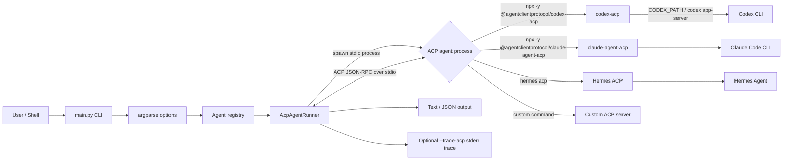
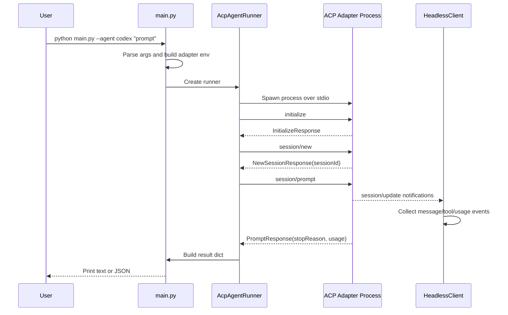
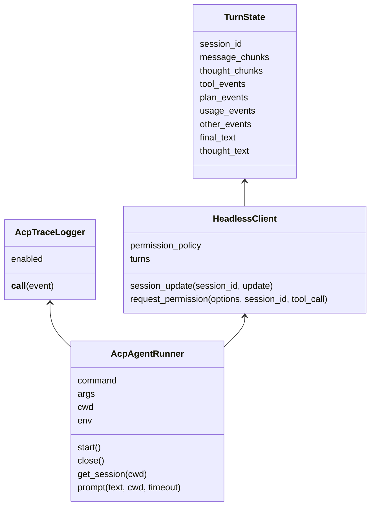
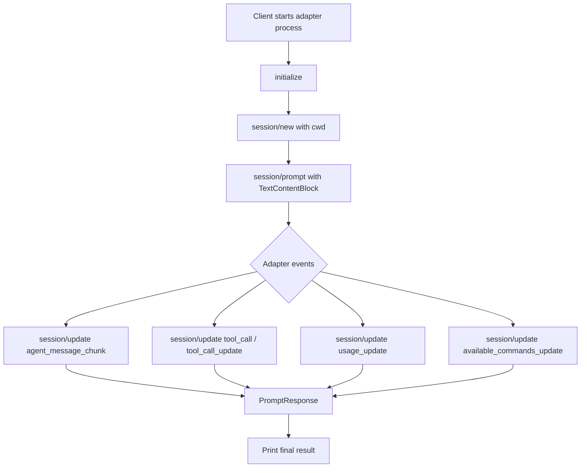
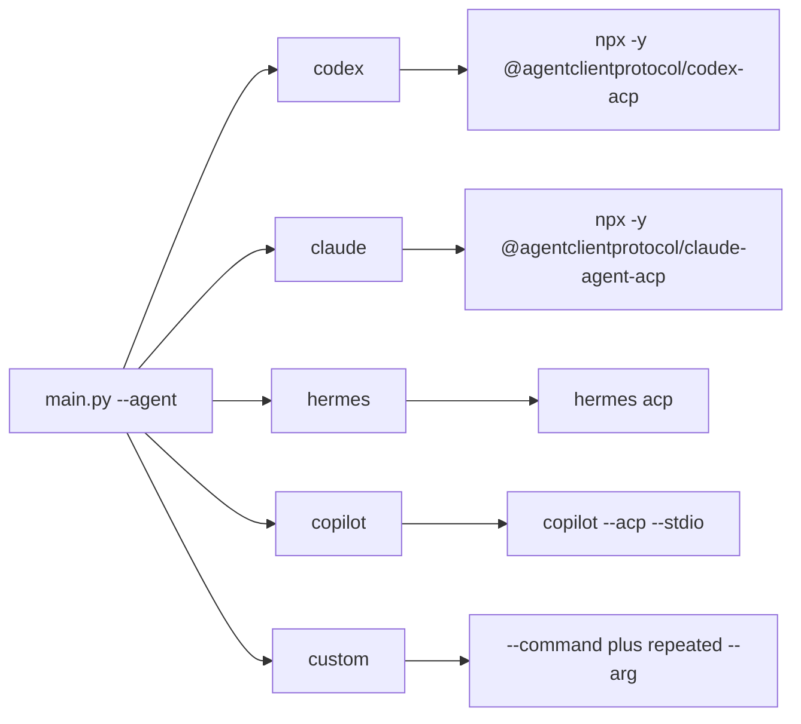

# ACP Python Client Architecture

This project is a small headless ACP client. It starts an ACP-compatible agent
process over stdio, sends JSON-RPC requests, collects session updates, and
prints either text or JSON results.

For the browser UI runtime, see
[WEB_SERVER_ARCHITECTURE.md](WEB_SERVER_ARCHITECTURE.md).

## System View

## Runtime Sequence

## Code Structure

## Main Components

| Component | Responsibility |
|---|---|
| `AGENT_REGISTRY` | Maps friendly agent names to default ACP adapter commands. |
| `build_parser()` | Defines CLI options such as `--agent`, `--cwd`, `--format`, `--trace-acp`, and `--codex-path`. |
| `build_adapter_env()` | Builds the child-process environment and passes `CODEX_PATH` for Codex when available. |
| `AcpAgentRunner` | Owns the ACP process, connection, session cache, prompt calls, timeout cancellation, and stderr tail. |
| `HeadlessClient` | Implements client-side ACP callbacks, especially `session/update` and `request_permission`. |
| `TurnState` | Stores streamed message chunks, thought chunks, tool events, usage, and other events for one turn. |
| `AcpTraceLogger` | Prints every ACP JSON-RPC message observed by the connection when `--trace-acp` is enabled. |
| `emit_result()` | Prints the final response in text or JSON format. |
| `emit_error()` | Prints JSON-RPC errors and adapter stderr tail for debugging. |

## ACP Message Flow

The client uses the `agent-client-protocol` Python package. The package creates
a JSON-RPC connection over newline-delimited stdio frames.

## Supported Agent Paths

## Notes

- `--cwd` is the workspace path sent to `session/new`; the server uses it as
  the project context for file access, commands, and repository awareness.
- `--trace-acp` prints parsed JSON-RPC messages to stderr. It is not a raw byte
  dump, but it preserves the ACP message bodies.
- `--codex-path` sets `CODEX_PATH` for `codex-acp`, which makes the adapter use
  a known Codex CLI binary.
- Interactive mode keeps one adapter process and reuses the ACP session cache
  per resolved `cwd`.
