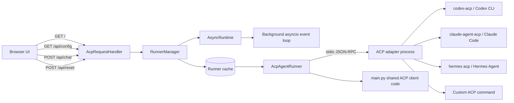
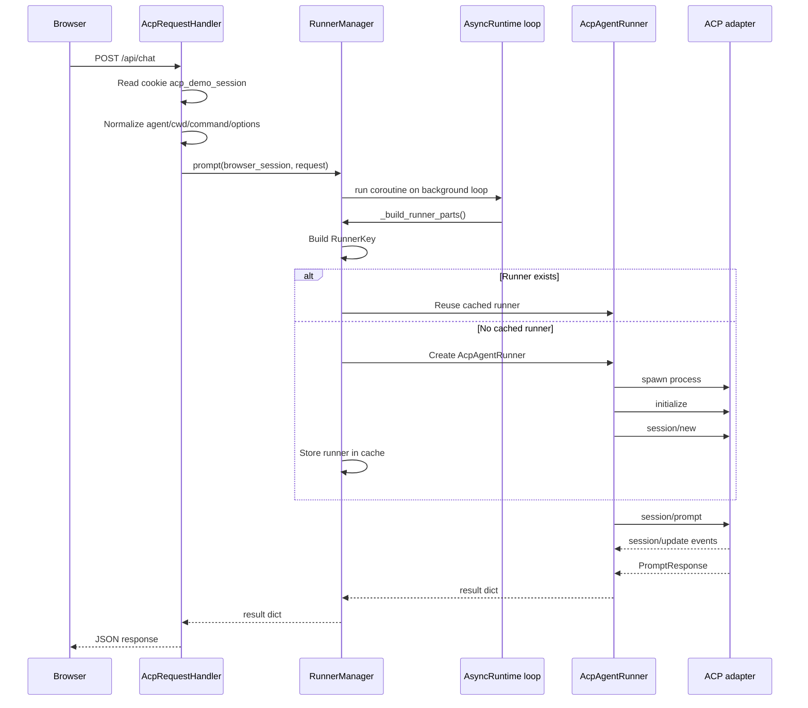
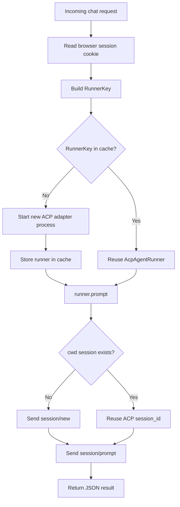
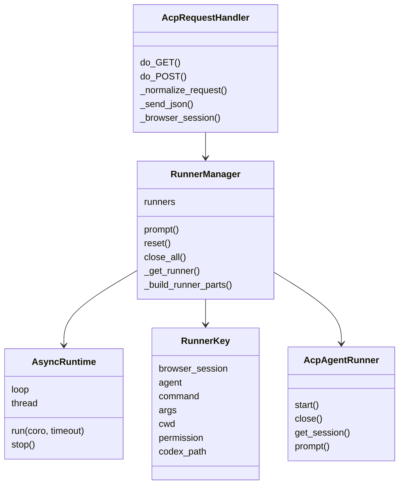
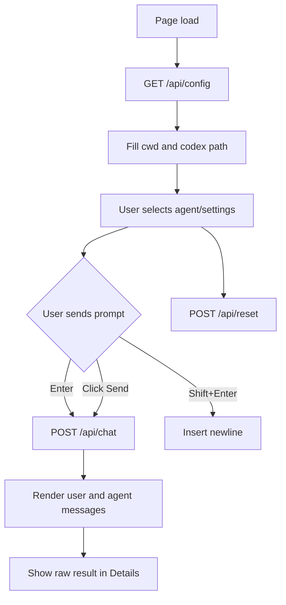
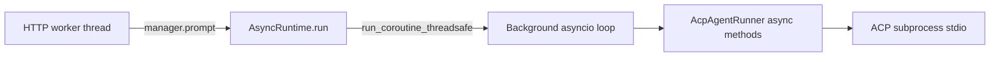

# Web Server Architecture

`web_server.py` provides a local browser UI for selecting an ACP agent and
chatting with it. It uses only the Python standard library plus the existing
ACP client code from `main.py`.

## System View



## Request Flow



## Multi-Turn Reuse



The cache key is:

```python
RunnerKey(
    browser_session,
    agent,
    command,
    args,
    cwd,
    permission,
    codex_path,
)
```

As long as these values stay the same, the web UI reuses:

- the same `AcpAgentRunner`
- the same ACP adapter subprocess
- the same stdio JSON-RPC connection
- the same ACP `session_id` for that `cwd`

## Component Map



## HTTP API

| Endpoint | Method | Purpose |
|---|---|---|
| `/` | `GET` | Returns the single-page HTML/CSS/JS UI. |
| `/api/config` | `GET` | Returns available agents, default cwd, and detected Codex path. |
| `/api/chat` | `POST` | Sends a prompt to the selected ACP agent and returns the result JSON. |
| `/api/reset` | `POST` | Closes cached runners for the current browser session and selected agent. |

## Browser UI Flow



## Concurrency Model

`ThreadingHTTPServer` handles HTTP requests in worker threads. ACP operations
must run on an asyncio event loop, so `AsyncRuntime` owns one background loop in
a dedicated daemon thread. The HTTP handler submits coroutines to that loop via
`asyncio.run_coroutine_threadsafe()`.



## Reset And Shutdown

- `Clear Chat` only clears browser-rendered messages.
- `Reset Session` calls `/api/reset`, closes cached runners for the current
  browser session and selected agent, and forces the next message to start a
  new ACP adapter process/session.
- Stopping `web_server.py` closes all cached runners, shuts down adapter
  subprocesses, and stops the background asyncio loop.
